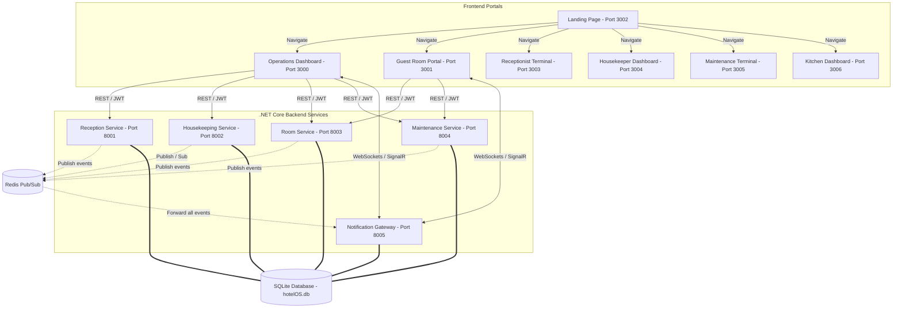

# HotelOS – Real-Time Event-Driven Hotel Operations System (.NET Core Microservices)

HotelOS is a real-time, event-driven hotel operations platform built using a modern microservices architecture. It simulates hotel workflows including guest check-in/out, automated room assignment, billing, housekeeping tasks, room service ordering, and maintenance priority dispatching. 

The application utilizes **ASP.NET Core Web API (Minimal APIs)** for microservices, **React** for user portals, **Redis Pub/Sub** for event brokering, **StackExchange.Redis** for Redis integration, **Entity Framework Core (EF Core)** for database operations, and **WebSockets (ASP.NET Core SignalR)** for streaming real-time notifications to client portals.

---

## 1. System Architecture

HotelOS consists of 5 independent C# backend microservices and 7 frontend portals structured in an npm Workspaces monorepo. Services communicate asynchronously through the Redis Pub/Sub message broker to remain decoupled, and share an SQLite database configured in WAL mode for high-concurrency data persistence.



---

## 2. Microservice Breakdown & Responsibilities

### 1. Reception Service (`HotelOS.Reception` - Port 8001)
* **Guest Check-In**: Assigns rooms automatically based on guest preferences (type, floor, elevator proximity) using a 6-step FIFO check-in heuristic protected by transactional locks (`SemaphoreSlim`).
* **Guest Check-Out & Billing**: Computes late fees, room service totals, minibar charges, and active discounts to output final billing previews and invoice checkout receipts.
* **Staff CRUD & Login**: Manages staff account verification (JWT token issuing based on roles).
* **API Endpoints**:
  * `POST /api/reception/login` - Staff login (JWT tokens)
  * `POST /api/reception/guest/login` - Guest login by credentials (Full Name, Room Number)
  * `POST /api/reception/guest/login/code` - Guest login by generated booking code
  * `POST /api/reception/staff` - Create new staff member (Admin-only)
  * `GET /api/reception/staff` - Get all staff members (Admin-only)
  * `DELETE /api/reception/staff/{id}` - Delete staff member (Admin-only)
  * `GET /api/reception/rooms` - Get all rooms with occupant info
  * `GET /api/reception/guests` - Get all checked-in guests
  * `POST /api/reception/checkin` - Run the automated room assignment check-in heuristic
  * `GET /api/reception/checkout/preview` - Preview checkout bill calculation
  * `POST /api/reception/checkout` - Check out guest, post bill to SQLite, and emit check-out / clean-needed events
  * `GET /api/reception/audit-logs` - View recent audit logs for receptionist actions

### 2. Housekeeping Service (`HotelOS.Housekeeping` - Port 8002)
* **Cleaning Task Queue**: Tracks pending, in-progress, and finished room cleaning tasks.
* **Event Broker Subscriber**: Listens for `room.vacated` events to automatically queue a room for cleaning and update its status to `Dirty`.
* **Reconciliation Loop**: Runs a background loop checking if database room states match active tasks, auto-generating tasks for any unaccounted dirty rooms.
* **Re-occupancy Preservation**: Checks if a room has an active occupant upon cleaning completion, reverting the room status to `Occupied` instead of `Clean` if a guest is checked in.
* **API Endpoints**:
  * `GET /api/housekeeping/tasks` - Get list of active and completed housekeeping tasks
  * `POST /api/housekeeping/tasks/{taskId}/start` - Assign/start a cleaning task (marks room as "Being Cleaned")
  * `POST /api/housekeeping/tasks/{taskId}/complete` - Finish cleaning task (reverts room to "Clean" if vacant, "Occupied" if checked in)
  * `POST /api/housekeeping/tasks/room/{roomNumber}/dirty` - Force a room dirty (manually triggered dirty task)

### 3. Room Service (`HotelOS.RoomService` - Port 8003)
* **Food & Beverage Menu**: Details itemized minibar and kitchen orders.
* **In-Memory FIFO Queue**: Holds active room service orders in a synchronized thread-safe queue.
* **Status Updates**: Updates order progress (`Received` $\rightarrow$ `Preparing` $\rightarrow$ `Out For Delivery` $\rightarrow$ `Delivered`) and publishes real-time sync events.
* **API Endpoints**:
  * `POST /api/room-service/order` - Guest orders food (inserts into FIFO thread-safe queue and SQL)
  * `GET /api/room-service/orders` - Staff list of all orders
  * `GET /api/room-service/queue` - Retrieve the thread-safe FIFO queue positions
  * `GET /api/room-service/guest/orders` - View orders specific to a guest (JWT validated)
  * `POST /api/room-service/orders/{orderId}/status` - Move order through queue stages (`Queued`, `Preparing`, `OutForDelivery`, `Delivered`)

### 4. Maintenance Service (`HotelOS.Maintenance` - Port 8004)
* **Ticket Dispatching**: Manages room repair logs and technician assignments.
* **Auto-Scheduler**: Schedules pending tickets automatically using an in-memory priority queue (Critical = 1, High = 2, Normal = 3, Low = 4) and handles timestamp-based tie-breakers.
* **Critical Lockout**: Critical priority tickets automatically change the room's status to `Maintenance`, locking it from reception check-in. Upon resolution, if a guest is currently checked in, the status reverts to `Occupied` (preserving their active session); otherwise, it reverts to `Dirty` to queue cleaning.
* **API Endpoints**:
  * `POST /api/maintenance/issue` - File room damage/issue ticket
  * `GET /api/maintenance/issues` - View all tickets
  * `GET /api/maintenance/room/{roomNumber}/issues` - View tickets for a specific room
  * `GET /api/maintenance/queue` - Get custom-priority queue of tickets
  * `POST /api/maintenance/issues/{issueId}/resolve` - Mark ticket as resolved, auto-revert room status, and re-allocate technician

### 5. Notification Gateway (`HotelOS.NotificationGateway` - Port 8005)
* **Real-time Event Streaming**: Subscribes to all events published to Redis Pub/Sub channels and broadcasts them to client portals via WebSockets.
* **Secure Guest Isolation**: Validates guest JWT claims to ensure rooms cannot listen to neighboring room events. It filters WebSocket events so guest portals only receive messages matching their authenticated room number.
* **API / WebSocket Endpoints**:
  * `WebSocket /ws` - Main real-time WebSocket connection that validates and streams filtered events to UI portals based on roles/room numbers.
  * `GET /health` - Health check endpoint

### Event Catalog (Message Broker Events)

The following table documents all asynchronous events sent over the Redis Pub/Sub `hotel_events` channel:

| Event Name | Publisher Service | Subscriber Service(s) | Payload Structure |
| :--- | :--- | :--- | :--- |
| `guest.checked_in` | Reception Service | Notification Gateway | `{ "guest_id": int, "guest_name": string, "reservation_code": string, "room_number": int, "nights": int, "room_type": string, "rate": double }` |
| `guest.checked_out` | Reception Service | Notification Gateway | `{ "guest_id": int, "guest_name": string, "room_number": int, "grand_total": double }` |
| `room.vacated` | Reception Service | Housekeeping Service | `{ "room_number": int, "guest_id": int }` |
| `room.status_changed` | Reception / Housekeeping / Maintenance | Notification Gateway | `{ "room_number": int, "status": string }` |
| `room.needs_cleaning` | Reception Service | Housekeeping Service | `{ "room_number": int }` |
| `room.cleaning_started` | Housekeeping Service | Notification Gateway | `{ "room_number": int, "task_id": int, "assigned_housekeeper": string }` |
| `room.cleaning_completed` | Housekeeping Service | Notification Gateway | `{ "room_number": int, "task_id": int }` |
| `order.placed` | Room Service | Notification Gateway | `{ "order_id": int, "room_number": int, "item_name": string, "quantity": int, "total_price": double, "status": string, "queue_position": int }` |
| `order.status_changed` | Room Service | Notification Gateway | `{ "order_id": int, "room_number": int, "item_name": string, "status": string, "queue_position": int }` |
| `maintenance.issue_created` | Maintenance Service | Notification Gateway | `{ "issue_id": int, "room_number": int, "description": string, "priority": string, "status": string }` |
| `maintenance.issue_assigned` | Maintenance Service | Notification Gateway | `{ "issue_id": int, "room_number": int, "assigned_technician": string }` |
| `maintenance.issue_resolved` | Maintenance Service | Notification Gateway | `{ "issue_id": int, "room_number": int }` |


---

## 3. Technology Stack

* **Backend (.NET 8/10)**:
  * **Framework**: ASP.NET Core Web API (Minimal APIs for performance and conciseness).
  * **ORM**: Entity Framework Core (EF Core) with SQLite.
  * **Messaging**: StackExchange.Redis for Pub/Sub asynchronous event communication.
  * **Real-time**: ASP.NET Core SignalR / WebSockets.
  * **Authentication**: JWT Bearer Authentication (custom claims for role-based staff isolation and room-based guest isolation).
* **Frontend**:
  * React 18, TypeScript, Vite, Vanilla CSS + TailwindCSS, Lucide React Icons, WebSockets.
  * Arranged in an **npm Workspaces Monorepo** for clean dependency sharing.
* **Database**:
  * **SQLite** configured in **WAL (Write-Ahead Logging)** mode with a `5000ms` busy timeout, enabling high-concurrency read-write transactions without locks.
* **Infrastructure**:
  * Docker for hosting the Redis container.

---

## 4. Critical Heuristic Algorithms

### Algorithm 1: Room Assignment Check-In
To prevent double-booking, room assignment runs inside a transactional lock (`SemaphoreSlim`):
1. **Filter Rooms**: Selects rooms of the requested type (`Single`, `Double`, `Accessible`, `Suite`) that are currently in `"Clean"` status.
2. **Longest Clean First (FIFO)**: Sorts candidates by `clean_since` timestamp so the room that has been clean the longest is assigned first.
3. **Floor Preference**: Filters rooms matching the preferred floor. If none are clean, it falls back to any available floor.
4. **Proximity Preference (Tie-Breaker)**: Order candidates based on proximity criteria (`Near Elevator`, `Near Stairs`, `Away From Elevator`).
5. **Assign**: Marks the room status as `"Occupied"`, binds the guest ID, and publishes `guest.checked_in` and `room.status_changed` events.

### Algorithm 2: Billing Calculation
$$\text{Subtotal} = (\text{Nightly Rate} \times \text{Nights}) + \text{Room Service} + \text{Minibar} + (\text{Late Checkout Hours} \times \$20)$$
$$\text{Discounted Subtotal} = \max(\text{Subtotal} - \text{Discount}, 0)$$
$$\text{Tax (10\% VAT)} = \text{Discounted Subtotal} \times 0.10$$
$$\text{Grand Total} = \text{Discounted Subtotal} + \text{Tax}$$
* Calculates stay nights dynamically on early checkouts (with a 1-night minimum).
* Supports both percentage and fixed cash discounts.

### Algorithm 3: Maintenance Priority Dispatch
Schedules tickets in a synchronized list using a custom priority algorithm:
* **Priority Values**: Critical = 1, High = 2, Normal = 3, Low = 4.
* **Tie-Breaker**: Sorts by `Priority` first, followed by `CreatedAt` timestamp, and lastly by `IssueId` to ensure older tickets get prioritized if urgency matches.
* **Technician Loop**: Auto-assigns free technicians (`John`, `Sarah`, `Mike`) to the top ticket when they finish their active jobs.

---

## 5. Execution Guide

### Prerequisites
* **Docker Desktop**: Must be installed and running.
* **.NET 8/10 SDK**: Installed.
* **Node.js**: Version 18+.

### Step 1: Start Redis
Start the Redis docker container on port `6379`:
```bash
docker run --name hotelos-redis -p 6379:6379 -d redis:alpine
```

### Step 2: Restore and Build the Backend
From the root of the project, navigate to the `dotnet` folder and build the solution:
```bash
cd dotnet
dotnet build
```

### Step 3: Launch the Backend Microservices
Run the PowerShell launcher script to start all 5 microservices in separate terminals:
```powershell
powershell -File start_all.ps1
```
*(Alternatively, navigate to each service folder inside `dotnet/` and run `dotnet run` manually).*

### Step 4: Run the Frontends
Navigate back to the root directory, install frontend dependencies, and launch Vite dev servers:
```bash
cd ..
npm install
npm run dev
```

The portals will start on the following ports:
* **Landing Page**: [http://localhost:3002](http://localhost:3002) (Start here to navigate to portals)
* **Operations Portal (Staff)**: [http://localhost:3000](http://localhost:3000)
* **Guest Portal**: [http://localhost:3001](http://localhost:3001)
* **Receptionist Terminal**: [http://localhost:3003](http://localhost:3003)
* **Housekeeper Dashboard**: [http://localhost:3004](http://localhost:3004)
* **Maintenance Terminal**: [http://localhost:3005](http://localhost:3005)
* **Kitchen Portal**: [http://localhost:3006](http://localhost:3006)

---

## 6. Testing Guide

### Running Automated Integration Tests
An automated test runner written in C# (.NET 10) is provided to run end-to-end integration scenarios. It verifies check-ins, checkout billing calculations, cleaning timer states, maintenance locking, and double-booking protections.

From the root of the project, run:
```bash
dotnet run --project dotnet/HotelOS.TestRunner
```

### Scenarios Tested
1. **TS-01**: Guest check-in requesting Double room on Floor 1.
2. **TS-02**: Checkout calculates correct bill, sets room to `Dirty`, and triggers a housekeeping task.
3. **TS-03**: Housekeeper starts/completes cleaning (Dirty $\rightarrow$ Being Cleaned $\rightarrow$ Clean).
4. **TS-04**: Guest places a room service order, validates price calculations, and advances it through the kitchen preparation queue.
5. **TS-05**: Reporting a Critical maintenance ticket auto-assigns a technician, locks the room under `Maintenance` status, and reverts it to `Dirty` after resolution.
6. **TS-06**: Proves double-booking transactional safety by running simultaneous check-ins on a single clean room.
7. **TS-07**: Gracefully blocks check-in with a validation error when no rooms are available.
8. **TS-08**: Validates check-in request schema values (blocks invalid types, nights out of range, etc.).

---

## 7. Git Commit History

Exported history of the project's development commits:

```text
3ad1d9b docs: append exported git log history to README
aae7d84 docs: add Message Broker Event Catalog table to README
f0b3ef3 cleanup: delete legacy python run_dashboard.py and test_runner.py scripts
eec5b15 cleanup: delete unused Python backend directory
5a50696 feat: implement HTTP requests and TS-01 to TS-08 test logic in C# TestRunner
cc7942d feat: add C# TestRunner project configuration to solution
fd4c457 fix: pre-build solution sequentially and run services with --no-build
dae5577 fix: clean up locked dotnet/compiler processes automatically on start
3dbd1d2 docs: add comprehensive Minimal API endpoints documentation to README
9569055 feat: complete C# .NET microservices migration and portal fixes
```

